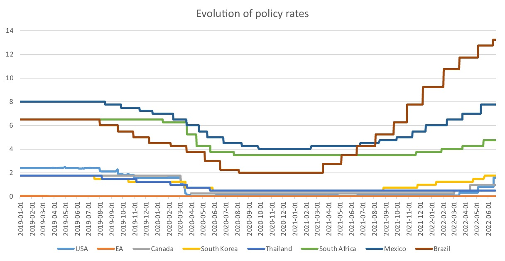

# 1. Introduction to monetary Problems

> **Currency**: 
> 
> - unit of account
> - express value of any good
> - medium of payment
> - store of value

= counterpart of legal flows

History:

- barter economy
	- needs „*double coincidence of needs*“ 
	- storage + transportation costs
- gold currency
	- large value / weight ratio
	- easily divisible
- modern banking system
	- expansion of debt+loans
	- fiat currencies

> **Exchange Rate:** projection of relative value against each other (currency pair)

- *direct* quotation: price of foreign in domestic
- *indirect* quotation: price of domestic in foreign

- *spot* exchange rate: todays prices
- *forward* exchange rate: quoted today, delivered later
	- adjusted for inflation differentials + interest rates

> **Arbitrage:** taking advantage of price differentials for same goo

= same prices = Purchasing Power Parity

$$
M_{i,j} = \frac{P_j}{P_i}
$$

- $M_{i,j}$ = exchange rate
- $P_{i},P_j$ = price levels in countries

# 2. PPP and Monetary Regimes

## Purchasing Power Parity

### absolute PPP

$$
r_{i,o} = \frac{P_i}{P_j}
$$

r = exchange rate

### relative PPP

$$
\frac{r_{i,j}^{t}}{r_{i,j}^{t-1}} = \frac{P_j^t}{P_j^{t-1}}/\frac{P_i^j}{P_i^{t-1}}
$$

allows for differential in inflation dynamics

### real exchange rate

$$
r_{I,J} = q(P_{I}/ P_J)
$$

with q = nominal exchange rate

## Exchange Rates

Determinants in the long run:

- inflation differentials
- degree of competition
- monetary policies
- productivity differential
	- higher prod = lower prices = higher PP
- Balassa-Samuelson Effect
	- price of services cheaper in LDC

Short Run: (financial variables)

- return on domestic assets
- return on foreign assets
- interest rate differentials

**Interest Rate Parity (IRP)**
$$
t_{i}= t_{j} - \frac{r_{i,j}^{t+1}-r_{ij}^{t+1}}{r_{ij}^t}
$$
with t = interest rates and r = exchange rates

- *uncovered IRP* = not taking into account exchange risk
- *covered IRP* = protecting with CDS

## Monetary Regimes

1. **Fixed** Exchange Rates
	- maintained by CB
	- pegged to basket of currencies / gold
	- CB needs reserves to answer demand
2. **floating** Exchange Rates
3. **dollarization** = currency of another country is legal tender
4. **Monetary Union**
5. **Currency Board**
	- domestic currency pegged to foreign currency
	- restrictions on monetary authority
	- e.g CFA-Franc
6.  Different Types of Pegs
	- horizontal bands
	- crawling pegs
	- managed floating without predetermined path

**Holy Trinity**

- fixed exchange rate
- independent monetary policy 
- perfect capital mobility

= choose only 2!

# 3. International Monetary System

### IMS Requirements

- convertible currency
- capital mobility
- legal system stability
- liquidity management rules
- external imbalance arrangements (floating, CB role etc.)

### Evaluation Criteria

- confidence
- stability
- ability to have *independent monetary policy*
- limited functional costs
- should allow balancing different goals
  - *internal balance:* low unempl. <-> inflation
  - *external balance*: trade equilibrium
  - *financial balance*: no BOP crisis 

## Balance of Payments

> **Balance of Payments (BOP)**: statement of all transactions made by entities (between them and rest od the world)

- all types of transactions
- quantity + value of products
- balance to 0 (accounting truth)

### Accounts

> **Current Account**: all transactions in terms of goods, services, income, asset transfers

= mostly imports / exports

> **capital account:** transactions of financial instruments / central bank reserves / monetary transfers

Exchange Rate effects (on current account)

- **Volume Effect** of ER ↑
  -  less foreign currency = less imports
  - Foreigners = more domestic currency = more exports
- **Value Effect**: relative price of the good

Which effect dominates?

- depends on elasticity (Marshall-Lehner condition)
  - higher elasticity = volume effect dominates
  - lower elasticity = value effect
- J-curve:
  - very short run: value effect
  - slower adjustment of imp. / exp.

## Reserve currencies

> **Reserve Currency**: currency that is held in significant quanitty by CB & Institutions as part of foreign exchange reserves

- used in int. trade / transactions
- used by CB to impact ER
- asset function

Advantages

- easy international trade
- ease of borrowing in your own currency
- lower ER (not exchaning that much)

Disadvantages

- speculative bubbles
- difficulty to maintain internal / external balances (*Triffin Dilemma*)
  - produce a lot of currency to make world happy (trouble exporting + inflation)
  - or protect economy (less currency available to foreigners)

# 4. Covid and Central Banks 

## Market Liquidity

Problem: missing liquidity after Covid-Crunch, more sellers then buyers

> **Liquidity**: efficiency to convert assets to cash 

Role of CB: step up the buying of assets in crisis
Problem: missing access to Dollar for foreign (central) bank

Actions of CB

1. Loans + Payment Facilities (Repo) to Commercial Banks
2. Quantitative Easing (Purchasing Programs etc.) 
3. Reduction of Reserve Requirements
4. on international level: Swap Lines (e.g by FED)

## Household Credit Access

Problem:
- HH out of work due to Covid Lockdowns
- Shutdown of Businesses due to lower Demand + Lockdowns

Actions:
- lower interest rates
- lower credit requirements for SME (like KFW-Kredit)

## Easing the Deficit

Problem: rising Rates = higher payments = even faster debt spiraling

Actions:
- lower interest rates
- direct buyment programs of Gov. Bonds

# 5. History of the Gold Standard

Introduction
- Germany 1875,
- France 1878
- US 1900

First: UK = main economic power at the time

Gold-Standard 

- needs constant convertibility to anyone
- at any bank (not only CB)
- No devaluation / appreciation (fixed exchange rate)

Problem: 

- Inflation is determined by relative price of gold
- no influence on the price of gold of one country
-  fluctuations in gold market! 

### Assumptions in the Gold Standard

 *Hume* Theory 

- only goal = price stability
- capital movements = adjustment mechanism (gold)
- no trade barriers: free movement of goods between countries
- participating countries = approx. same size

What happens in an current account deficit?

- gold outflow
- money supply contraction: relative price of gold ↑
- lower prices (no devaluation!)
- lower imports + more exports

### Reality of the Gold Standard

- Pound Sterling = international currency
- sterling = exchangable to gold

=> *gold points* (exchange rate boundaries)

- barriers where own currency => gold
- is prefereable to currency => sterling
- e.g when weak currency / depreciation

Therefore: 

- limit depreciation of currency
- otherwise gold would be used

Why Sterling?

- UK = biggest trader + clearing union + international financial hub
- silver = lighter than gold
- colonial / military power of the Crown

> **Clearing Union:** Settlement / Cancellation of bilateral Balances 

### Failure of the Gold Standard

- WW1
  - massive public spending => inflation
  - exchange rate pressure
- Additional reasons
  - trade barriers introduction
  - different size + one hegemon (UK)
  - price stability = not only focus
- downfall of the UK
  - ascension of the US + Germany (and their currencies)
  - Anti-colonial rise

# 6. History of Bretton Woods

Conference of Bretton Woods:

- July 1944 in Bretton Woods (New Hampshire)
- After-war system of monetary management
- 44 countries

Reasons for introduction

- after WW2 = growth + rebuild
- international stabilization

intended Features

- avoid competitive devaluations
- flexibility of policies for recovery
- limit capital flows

### Country Positions

US:

- represented by White
- free trade (no preferential agreements)
  - Esp. UK in imperial agreements
- fixed exchange rates
- one reserce currency = US dollar
- no large exchange rate movements
  - monetary stabilization fond

UK:

- represented by Keynes
- adjustable exchange rates (with limits)
- country = control their international trade (protectionism etc)
- reserve currency *Bancor* (not USD)
- automatic adjustment 
  - surplus / deficits in Bancor
  - only usable for int. trade 
  - in the system: automatic 

## The final System

=> End result = very close to US position

- higher economic power
- US loans to European Country

Key Parts

- USD = reserve currency 
  - only convertible to gold
- all other currencies = exchange to USD
- Creation of IMF = for BOP crisis
- World Bank = rebuilding effort
- GATT = free trade guarantor

Rules

- for US
  - nominal anchorage
  - maintain price stability
  - no large deficits (healthy public finance)
  - open + liquid capital market
- everyone else:
  - USD as invoice currency
  - maintain parity of domestic currency <--> USD
    - maximum +- 1%
  - adjustment only in case of fundamental disequilibrium
  - current account deficit = loan from IMF

=> favorable for the US

- finance US consumption = price paid by others
- demand for treasury bills from countries

## History

First 15 years = really good

- reconstruction period
- large offering of dollars by the US 
- marshall plan
- European Payment Union (1950)
  - clearing union between European Countries
  - no trade barriers inside
  - help recovery

Reasons for downfall

- US deficits (commercial & fiscal deficits)
- economic divergence
- speculative attacks

The End:

- Vietnam War Financing
- Nixon Shock (1971) : stop exchangebility to Gold

failed Projects

- gold pool = western agreement to control gold price 
- Special Drawing Rights (SDR) = share of World Bank
- roosa bonds = short term bonds by US to foreign CBs

