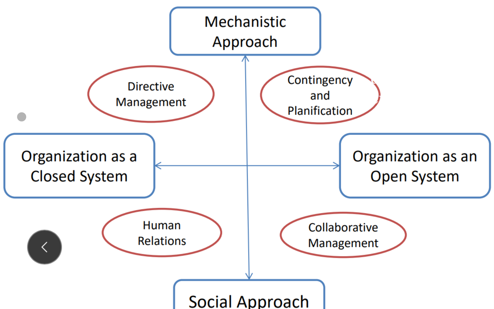

## Organizational Theory

> **Organization:** set of peopl working together desptec variuos aims, values, cultures

## Key Parts of Organizations

1. Environment
2. Technology
3. Participants
4. Social Structure
5. Goals / Objectives

> **Environment**:
> - Macro: Society, Global
> - Micro: Industry, Market

> **Participants**: make contributions / derive from org.

Problem: 
- Diffusion of Responsibility
- no Common Aim
- Coordination Problems

### Organizational Structures

- Pyramid: Military
- Network: Forum, Mailing List
- Team Spirit: Engineers, Civil Servants

Processes in Organizations

- Co-Ordination = planned by authority
- Co-Operation = division of labor, also creates conflict

> **Effectiveness:** decided by the client, e.g Quality, Price

> **Efficiency:** measured by management, e.g Quality (devided), Cost, …

How to measure perfomance? Impossible
- Consistence / Relevance
- Productivity
- Effectiveness
= magic triangle

### Purpose of Organizations

- *Instrumental View:* single set of values in org
- *Conflict view:* conflicting values, managers expose, explore, participate
- *Pluralist View:* mixed of everything

- *Pessimist:)*: Machines of Exclusion

SPLIT

- Structure
- Process
- Language
- Idea
- Technology

## Organizational Theory

Evolution of OT

Organization Theorists to name drop:
- Max Weber
- Frederic Taylor
- Taiichi Ohno

Management Theorists to name drop:
- Henri Fayol
- Peter Drucker

### Bureaucracy (Weber)

> Management is the art of getting things done by others
> ~ Marie Follett

Types of Authority
- Charismatic (e.g Jesus)
- Traditional (Pope)
- Rational - Legal (Doctor with Education)

Weber: *rational legal authority* is rising = ideal type

- Authority comes from office
- official duties
- paid, full-time, career structure
- hierarchy + reporting structure
- division of labor
- employment = qualification + experience

Virtues of B.
- Hierarchy
- Impersonality
- System of Rules

### Scientific Management (Taylorism)

Before: small Workshops that produce a whole good

Characterisics:
- Division of Labor
- Standardisation
- Clear Chain of Command
- Payment linked to production

Outcomes
- higher productivity
- separate / mundane work
- managers - workers distinction was created