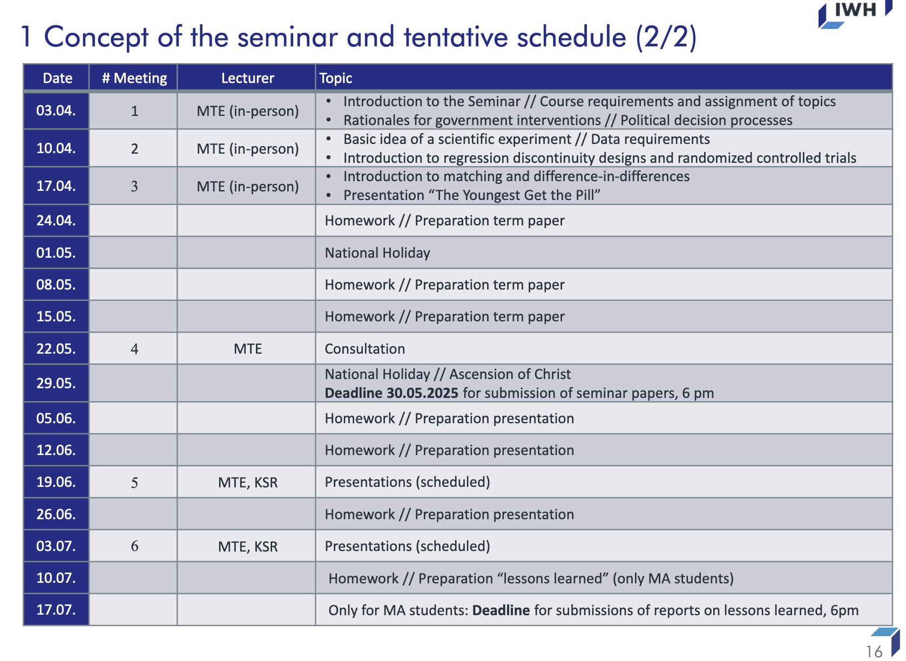

# Evidence Based Policy Advice

Schedule

Seminar paper (weight: BA 50%, MA 30%)

- Summary report of the paper to be discussed
- “Guide to writing scientific papers” at the Chair of Economics
- Contrary to the announcement in the Guide we will reduce the required number of pages to
10-15 (5-8 per student).
- Please, upload your reports to StudIP (technical details will be announced soon)
- send your reports attached to an email to Mirko Titze and Sarah Fritz (contact details
below)
- Deadline for the submission: May 30, 2025, 6pm

Presentation (weight BA and MA 40%)

- 20 min
- Presentation material, Powerpoint

Active participation in our sessions (weight BA and MA 10%)
