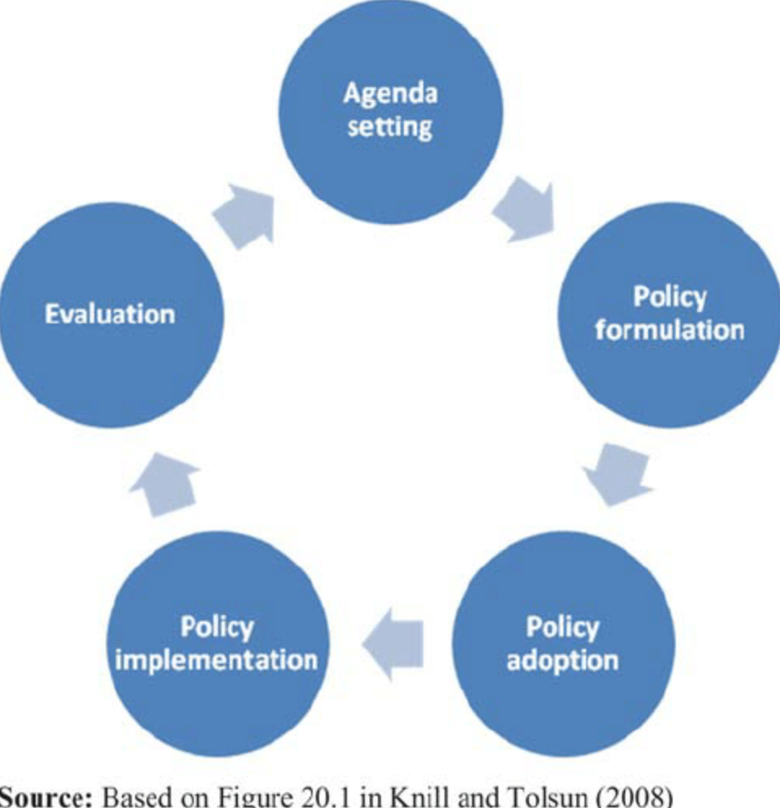

# 10.04.2025 Evidence Based Policy Advice

## Policy Cycle

- very idealized
- following Knill and Tolsun (2008)
- based on "rational" politicians

## EU Cohesion Policy

1: Agenda Setting

- Goals: social and territorial cohesion, four freedoms
- Indicatros: GDP, unemployment rate

2: Policy Formulation

- Problem Analysis: impact channels?
- Determination of Side Effects

3: Policy Adoption

- Decision Making on relevant policy
- and on specific rules of intervention

4:

## Identification and Causal Inference

[Maryland Guide](https://whatworksgrowth.org/wp-content/uploads/16-06-28_Scoring_Guide.pdf): Guide to scoring evidence using the Maryland Scientific Methods Scale

- Score from 1 to 5
- Score 3 = adequate study to include in policy determination

Methods for Causal Inference

- Expermintel Approaches
  - Field Experiment
  - Laboratory Experiment
- Quasi-Experimental
  - Matching / Synthetic Control Method
  - Difference in Differences
  - Instrumental Variables
  - Regression Discontinuity Design

 

General Requirements for good Design

- Rules for Assignment = known
- Good Data
  - on all characteristics that might drive the outcome
  - for treated and controls
- Solution for missing control group data:
  - Record Linkage

Case: Regression Discontinuity Design

- where RCTs are not feasible
- use Differentiation closely around the cutoff of a policy

Requirements:

- Continous Treatment Variable